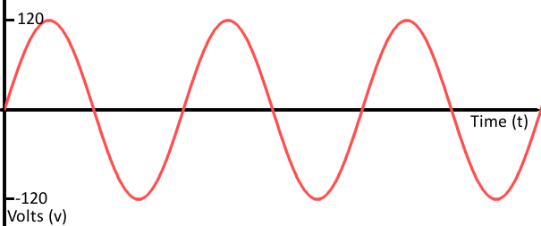

# Contents
> This is a demo created by Ian Rohrbacher for HacKSU at Kent State University

* [Gettting Started](#gettting-started)
* [Digital Signals](#digital-signals)
  * [Input](#input)
  * [Output](#output)
* [Analog Signals](#analog-signals)
  * [Input](#input-1)
  * [Output](#output-1)
* [Components](#components)
  * [Servos](#servos)
  * [Display](#display)

# Lessons on Arduino
Arduino is an open-source electronics platform that makes it easy to create interactive projects. In the Arduino IDE, you can control LEDs, motors, and sensors using C++, *with just a few tiny differences*. It's widely used for prototyping and robotics, making it a great tool for anyone to use.
<br><br>
The following is an introduction to the basic skills you will need to know to get started. We will place less emphasis on electrical wiring and more on hardware and software.

# Gettting Started
We will use [wokwi](https://wokwi.com/) for simulation. We will be using the [ESP32](https://wokwi.com/esp32) environment. The ESP32 is currently one of the best microcontrollers you can work with. Again we won't dive into the electrical aspect of the ESP32, but it is important to know the [pinout sheet](images/ESP32-Pinout.png) of the board. This will tell you what the numbers for your pins are and what the pins can do. We don't have to worry too much however because most of the pins are PWM allowing easy conversion from analog to digital.

# New Project
After selecting the ESP32 simulator, scroll down until you find 'Starter Templates' and select 'ESP32'. Welcome to your first project! Here you will see a few essentials; 'setup()', 'loop()', 'Serial', 'delay()'.
```ino
void setup() {
  // put your setup code here, to run once:
  Serial.begin(115200); // starts a serial connection
  while(!Serial){} // wait until Serial is created
  Serial.println("Hello, ESP32!"); // prints to the serial
}

void loop() {
  // put your main code here, to run repeatedly:
  delay(10); // this speeds up execution time
}
```
* setup(): Runs once at the beginning or on startup. Here, we will define important variables like defining pins and starting serial communication.
* loop(): Runs continuously while active. Here is where all executing logic goes.
* Serial: Used as an output stream.
> [!IMPORTANT] 
> Always check your microcontroller for which port number to use, standard is 9600 however the simulator uses 115200. 
* delay(): This is your 'wait' statement. This is used to limit the amount of cycles the 'loop()' will make to ensure memory isn't being wasted.

<br><br><br><br>
# Digital Signals
A digital signal is a type of signal that has only two discrete states: HIGH (1) or LOW (0). In Arduino, digital signals are used to communicate with components like LEDs, buttons, motors, and sensors, *however with limited control.*

<br><br>

## Output
To start, open the diagram.json file in the simulator and copy [this JSON](digital/write-one.json). You should see a circuit with an LED. Let's learn how to control this LED.
<br>
Let's first define a variable for the pin, it is currently connected to pin 19.
```ino
int pin = 19;

void setup() {
  Serial.begin(115200);
  while(!Serial){}
  Serial.println("Hello, ESP32!");
}

void loop() {
  delay(10);
}
```
Next, we need to let the microcontroller, *ESP32*, know how to handle this pin. We can use pinMode with the parameter of the pin and OUTPUT telling it we will be outputting through this pin.
```ino
void setup() {
  Serial.begin(115200);
  while(!Serial){}
  Serial.println("Hello, ESP32!");

  pinMode(pin, OUTPUT);
}
```
Now we can give the pin a state. To do this we can use digitalWrite with the parameter of the pin and the current state we want the LED to be in. For digital output, we can only use HIGH and LOW.
```ino
void setup() {
  Serial.begin(115200);
  while(!Serial){}
  Serial.println("Hello, ESP32!");

  pinMode(pin, OUTPUT);
  digitalWrite(pin, HIGH);
}
```
Now that we know how to use the LED let us add some basic logic into the loop() to toggle the LED on and off after some time.
```ino
int pin = 19;
bool toggle = false;

void setup() {
  Serial.begin(115200);
  while(!Serial){}
  Serial.println("Hello, ESP32!");

  pinMode(pin, OUTPUT);
}


void loop() {
  digitalWrite(pin, toggle ? HIGH : LOW);

  Serial.println(toggle);
  toggle = !toggle;
  
  delay(1500);
}
```

## Input
Now that we know how to change the LED in the code, let's add a button to control it instead. Open the diagram.json file in the simulator and copy [this JSON](digital/read-one.json). You should see the circuit with an LED now with a button.
<br>
Let us redefine the LED pin and add a button pin that is connected to pin 14. Let us also set the pinMode to the button to INPUT so we can read the state.
```ino
int LED_pin = 19;
int Button_pin = 14;

void setup() {
  Serial.begin(115200);
  while(!Serial){}
  Serial.println("Hello, ESP32!");

  pinMode(LED_pin, OUTPUT);
  pinMode(Button_pin, INPUT);
}
```
To read from the button we use digitalRead. This will return the state of the button, HIGH or LOW. Now let us modify our logic from before and have digitalRead cast to a boolean.
```ino
void loop() {
  bool pressed = digitalRead(Button_pin);
  digitalWrite(LED_pin, pressed ? HIGH : LOW);

  Serial.println(pressed);
  
  delay(100);
}
```
As you can see the digitalRead and digitalWrite are now inside the loop() allowing it to update every tick, defined by the delay.
<br>
If you ran this you might have noticed something, the button inconsistently updates the LED. This is due to the microcontroller flowing unsteady electricity through the button. We can fix this by changing the INPUT to INPUT_PULLUP which will ensure a HIGH stream of electricity to flow.
```ino
  pinMode(Button_pin, INPUT_PULLUP);
```

### For Fun
I have created a model that uses three LEDs that change one after another [here is the JSON](digital/digital-three.json).
```ino
int pinR = 18;
int pinG = 5;
int pinB = 17;
int pinList[] = {pinR, pinG, pinB};
int state = 0;

void setup() {
  Serial.begin(115200);
  while(!Serial){}
  Serial.println("Hello, ESP32!");

  for(int pins : pinList) {
    pinMode(pins, OUTPUT);  // Use a valid GPIO number
  }
}


void loop() {
  digitalWrite(pinR, state==0 ? HIGH : LOW);
  digitalWrite(pinG, state==1 ? HIGH : LOW);
  digitalWrite(pinB, state==2 ? HIGH : LOW);

  Serial.println(state);
  state = (state == 2 ? 0 : state+1);
  
  delay(1500);
}
```


<br><br><br><br>
# Analog Signals
An analog signal is a continuous signal that varies over time and can take any value within a given range. Unlike digital signals that are either HIGH (1) or LOW (0), analog signals can have infinite possible values. Analog signals are able to use the same components as digital; LEDs, buttons, motors, and sensors, however with finer control.

<br><br>

## Output
We will start once again with editing the diagram.json file. We will reuse the digital output diagram, however with a purple LED [JSON](analog/write-one.json). 
<br>
We will make a small modification from the digital output code.
```ino
int pin = 19;
int value = 0;

void setup() {
  Serial.begin(115200);
  while(!Serial){}
  Serial.println("Hello, ESP32!");

  pinMode(pin, OUTPUT);
}

void loop() {
  value = value>255 ? 0 : value+10;
  analogWrite(pin, value);
  Serial.println(value);

  delay(500);
}
```
Now instead of the LED turing on and off, it slowly climbs in brightness and resets after passing 255. 0-255 is the range of analogWrite which is why it will reset after 255.

## Input
Now that we saw the LED changing brightness, let's see how we can manually alter it. Open the diagram.json file in the simulator and copy [this JSON](analog/read-one.json). You should see the circuit we had befor with the potentiometer.
<br>
Similarly to the button, a potentiometer gives us a input. Unlike a button, where it has two states, a potentiometer has infinitely many states. For a ESP32 this is measure as a range from 0-4095. If we wanted to change that range for the LED to work properly, we can use a built in function 'map'. map allows us to alter any range as another, for our case 0-4095 to 0-255.
```ino
int pot = 14;
int LED = 19;

void setup() {
  Serial.begin(115200);
  while(!Serial){}
  Serial.println("Hello, ESP32!");
  
  pinMode(pot, INPUT);
  pinMode(LED, OUTPUT);
}

void loop() {
  int value = map(analogRead(pot), 0, 4095, 0, 255);
  analogWrite(LED, value);
  
  Serial.println(value);
  delay(100);
}
```
If you are using map make sure you know the range of the orignal input, as having a difference can lead to unreliable outputs.

### For Fun
I have created an array of LEDs in the RGB colors along with a RGB LED. Potentiometers come in all styles too, so here I am using a nob. Each nob controls the brightness of their respective RGB colors and by mixing them you can see how the RGB LED reacts. [Here is the JSON](analog/analog-RGB.json)
```ino
int RPin = 19;
int GPin = 18;
int BPin = 5;
int ponRPin = 26;
int ponGPin = 27;
int ponBPin = 14;

void anode(int R, int G, int B) {
  analogWrite(RPin, map(R, 0, 4095, 0, 255));
  analogWrite(GPin, map(G, 0, 4095, 0, 255));
  analogWrite(BPin, map(B, 0, 4095, 0, 255));
}

void printRGB(int R, int G, int B) {
  Serial.println("-------------------------------");
  Serial.println("R:"+String(map(R, 0, 4095, 0, 255)));
  Serial.println("G:"+String(map(G, 0, 4095, 0, 255)));
  Serial.println("B:"+String(map(B, 0, 4095, 0, 255)));
}

void setup() {
  Serial.begin(115200);
  while(!Serial){}
  Serial.println("Hello, ESP32!");

  pinMode(ponRPin, INPUT);
  pinMode(ponGPin, INPUT);
  pinMode(ponBPin, INPUT);

  pinMode(RPin, OUTPUT);
  pinMode(GPin, OUTPUT);
  pinMode(BPin, OUTPUT);
}

void loop() {
  int red = analogRead(ponRPin);
  int green = analogRead(ponGPin);
  int blue = analogRead(ponBPin);

  anode(red, green, blue);
  printRGB(red, green, blue);

  delay(100);
}
```

# Components
Arduino can interface with various external components like sensors, motors, displays, and more. These components communicate through different methods such as digital I/O, analog inputs, PWM, I2C, SPI, and UART. You can see on the [pinout sheet](images/ESP32-Pinout.png) of the ESP32 how the pins are defined. We will go over servos and one display board.


## Servos
Servos are a type of motor that allows for precise control of angular position, speed, and torque. The unique thing about servos is that they can hold a position rather than continuously rotating.
<br>
Using our knowledge of analog inputs, we will read from a potentiometer to move a servo. lets use the new [diagram here](servo/servo-one.json) and this code as a start.
```ino
int pot = 14;

void setup() {
  Serial.begin(115200);
  while(!Serial){}
  Serial.println("Hello, ESP32!");
  
  pinMode(pot, INPUT);
}

void loop() {
  int value = analogRead(pot);
  
  Serial.println(value);
  delay(100);
}
```

In Arduino, a servo is its own class. To use this class we need to import ESP32Servo.h, open the 'Library Manager' and add 'ESP32Servo'. Next in the code, we need to include ESP32Servo.h. Now we can create a servo object and give it a pin to read from.
```ino
#include <ESP32Servo.h>

int pot = 14;
const int servoPin = 5;

Servo servo;

void setup() {
  Serial.begin(115200);
  while(!Serial){}
  Serial.println("Hello, ESP32!");
  
  pinMode(pot, INPUT);
  servo.attach(servoPin);
}
```

This servo can only hold 0-180 degrees so we will use a map to change the output of the potentiometer to match. Writing to the servo is easy, just call the write method from the object passing the potentiometer's changed value.
```ino
void loop() {
  int value = map(analogRead(pot), 0, 4095, 0, 180);
  servo.write(value);
  
  Serial.println(value);
  delay(100);
}
```

There you have it, now you can change the position of the servo using the potentiometer as input.

## Display
We have been using the serial ports to read data. And if you remember, you need the microcontroller to be plugged into your computer to read that data. Now what if we didn't want to be plugged in? This is where onboard displays come in.
<br>
Just like servos, we need to import the library 'Adafruit SSD1306'. Unlike the servo, it matters which pins you use. We need to look at both the [ESP32](images/ESP32-Pinout.png) and the [OLED display](images/I2C-OLED-Display-Pinout.png) pinout sheet. We need to match the SCL and SDA pins. There are pin 22 and pin 21 respectively. The full diagram can be found [here](display/display-one.json)
<br>
Just like the servo, we need to include Adafruit_SSD1306.h. Next, create an Adafruit_SSD1306 object with the parameters screen width and screen height. In setup, we start the display, apply styles, and clear the display.
```ino
#include <Adafruit_SSD1306.h>

Adafruit_SSD1306 display(128, 64);

void setup() {
  display.begin(SSD1306_SWITCHCAPVCC, 0x3C);
  display.setTextColor(WHITE);
  display.setTextSize(1);
  display.clearDisplay();
}
```

To use the display there are many functions in the Adafruit_SSD1306 class, but we will focus on text. To choose the origin of the text we can move it using setCursor and print to the screen wex use .print() like any other print method. The last thing you need to do is call .display(). The OLED display does not update automatically when you draw text or shapes. Instead, you are writing to a buffer inside the microcontroller. The function .display() sends the buffer contents to the actual screen.

```ino
void setup() {
  ...

  display.setCursor(0,5);
  display.print("Hello World!");
  display.display();
}
```

### For Fun
Using the slide potentiometer as an input, I have made it print custom text depending on how much the potentiometer has moved. [Diagram here](display/display-many.json)

```ino
#include <Adafruit_SSD1306.h>

Adafruit_SSD1306 display(128, 64);

int pot = 14;

void printSwitch();

void setup() {
  display.begin(SSD1306_SWITCHCAPVCC, 0x3C);
  display.setTextColor(WHITE);
  display.setTextSize(1);
  display.clearDisplay();
  
  pinMode(pot, INPUT);
}

void loop() {
  printSwitch(map(analogRead(pot), 0, 4095, 0, 5));

  delay(100);
}

void printSwitch(int value) {
  display.clearDisplay();
  display.setCursor(0,15);

  switch(value) {
    case 0:
      display.print("I love switches");
      break;

    case 1:
      display.print("Who needs ifs");
      break;

    case 2:
      display.print("FRC > Vex");
      break;

    case 3:
      display.print("IDK... Something");
      break;

    case 4:
      display.print("Thanks for watching");
      break;

    case 5:
      display.print("This is the end");
      break;

  }

  display.display();
}
```
